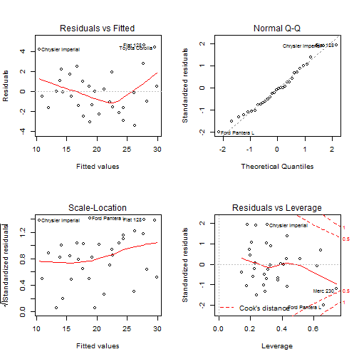

MTCARS Operations
========================================================
author: Miguel Alfonso Bustamante Sanchez
date: August 13, 2017
autosize: true

Plot function selector
========================================================
You are able to select the plotting function with a checkbox, easily change between hist() and plot() with a sigle click.


Simple linear model
========================================================
With the click of a button you may fit a simple linear model.


```r
fit <- lm(mpg ~ ., data = mtcars)
        par(mfrow = c(2, 2))
        plot(fit)
```


Personalized model
========================================================
Or you can choose a model you want by writting it in the text, based on the mtcars data.


```r
fit <- lm(mpg ~ ., data = mtcars)
        par(mfrow = c(2, 2))
        plot(fit)
```



Coefficients
========================================================
You can also display the coefficients with the click of a button


```r
fit <- lm(mpg ~ ., data = mtcars)
        summary(fit)$coef
```

```
               Estimate  Std. Error    t value   Pr(>|t|)
(Intercept) 12.30337416 18.71788443  0.6573058 0.51812440
cyl         -0.11144048  1.04502336 -0.1066392 0.91608738
disp         0.01333524  0.01785750  0.7467585 0.46348865
hp          -0.02148212  0.02176858 -0.9868407 0.33495531
drat         0.78711097  1.63537307  0.4813036 0.63527790
wt          -3.71530393  1.89441430 -1.9611887 0.06325215
qsec         0.82104075  0.73084480  1.1234133 0.27394127
vs           0.31776281  2.10450861  0.1509915 0.88142347
am           2.52022689  2.05665055  1.2254035 0.23398971
gear         0.65541302  1.49325996  0.4389142 0.66520643
carb        -0.19941925  0.82875250 -0.2406258 0.81217871
```
